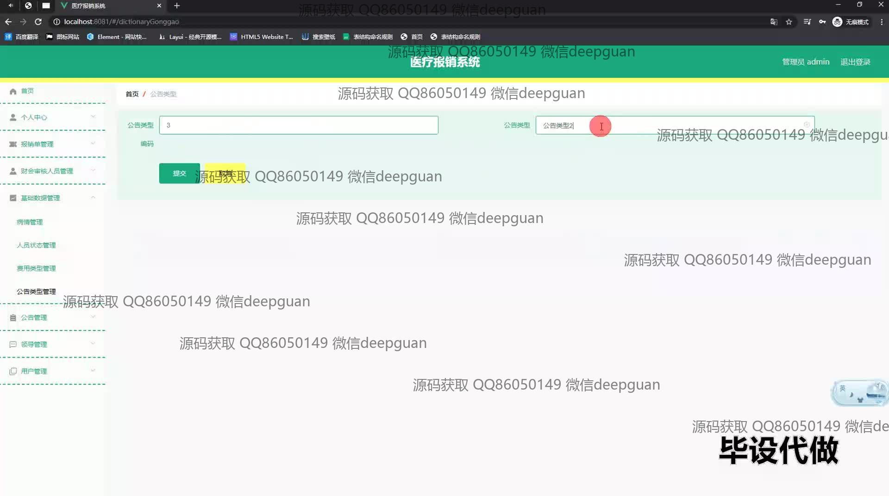
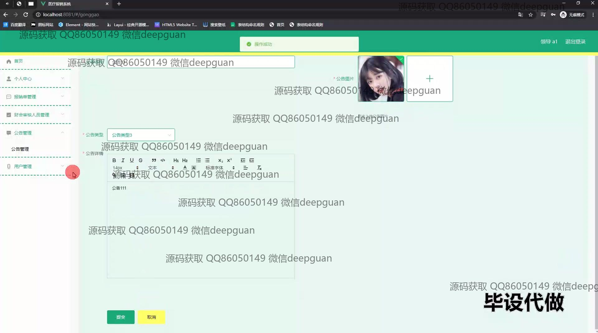
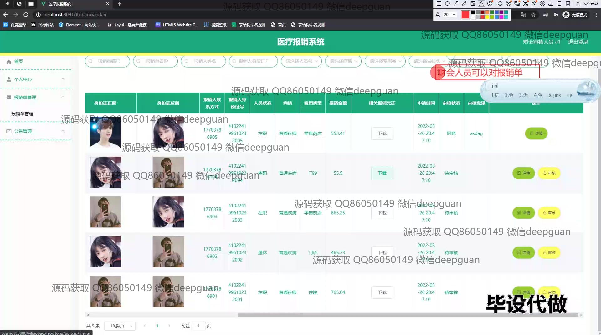
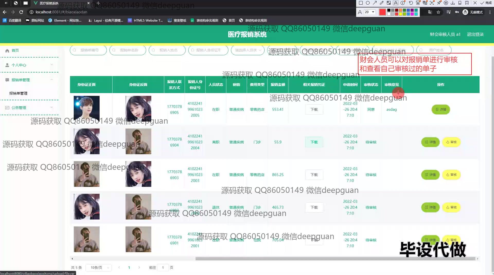
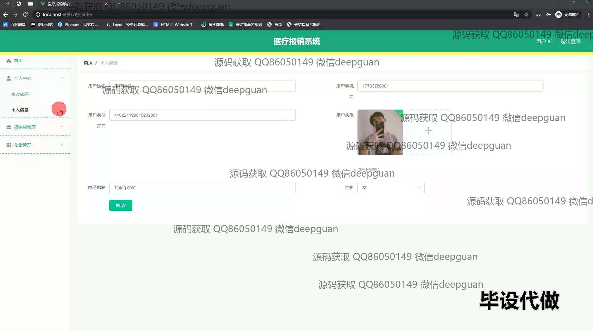
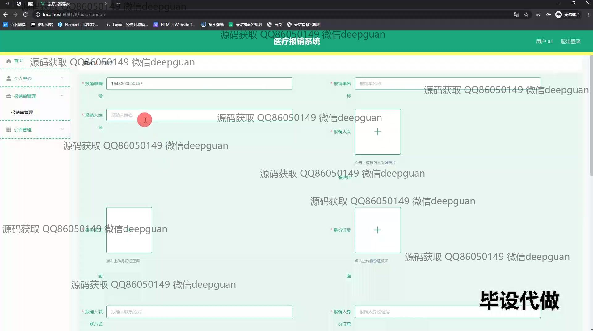
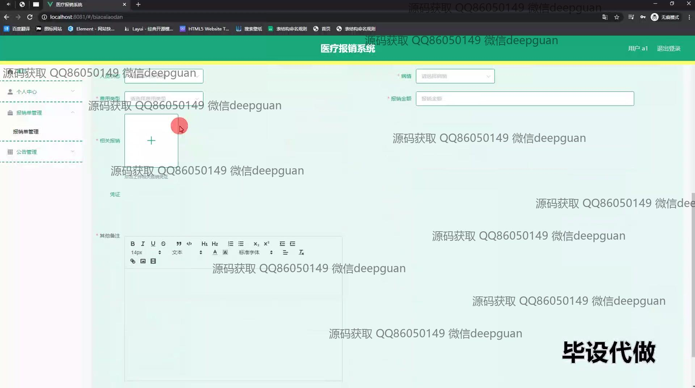
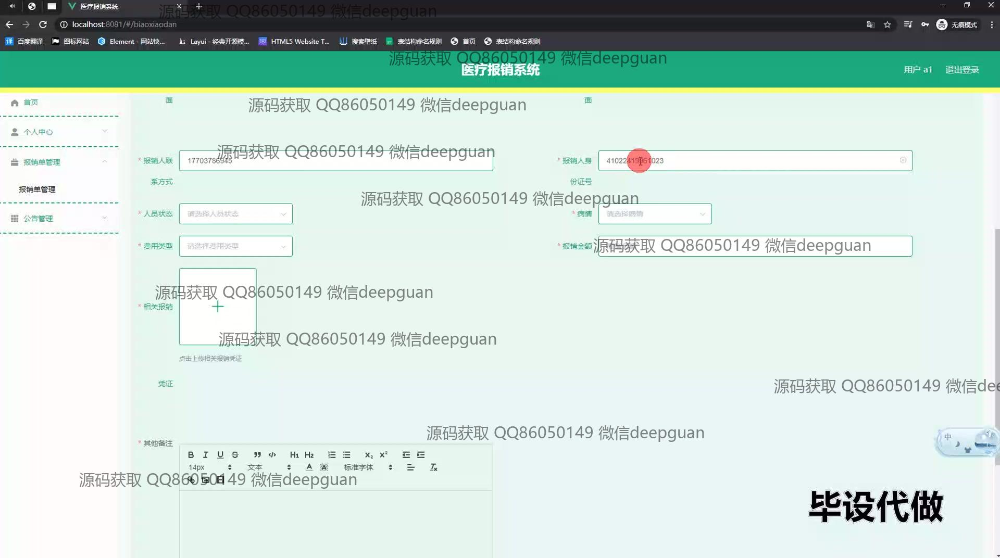
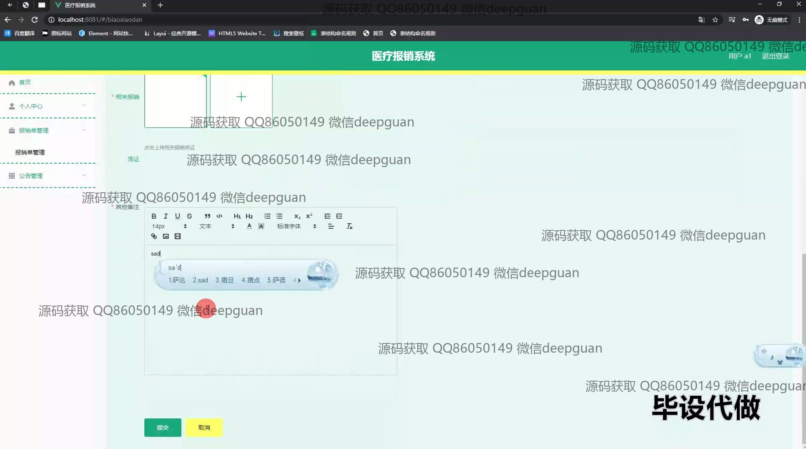
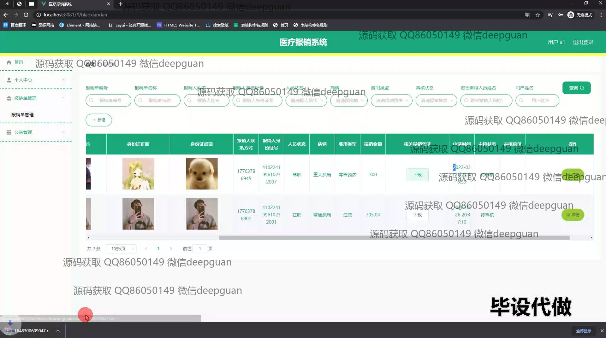

<h1 align="center">基于医疗报销系统的设计与实现</h1>

## 简介
医疗报销系统：角色分为管理员、用户；用户功能包括提交报销申请、查询报销状态、管理个人信息；管理员功能包括审核管理、人员管理和公告管理，提供简洁高效的医疗报销流程及操作体验。    --计算机毕业设计源码；毕设源码；java毕业设计源码

## 联系方式

<h3 align="center">获取完整代码与数据库文件 + 微信：deepguan QQ: 86050149 QQ群: 783742310</h3>

<h3 align="center">可帮忙远程部署 包运行成功！提供远程部署、修改代码、设计文档指导、代码讲解等服务！</h3>

## 功能介绍（完整见运行截图）
管理员：管理员可通过登录系统进入审核管理模块，查看和处理待审核的报销申请，确保报销流程的合规性与效率。除此之外，管理员能够管理报销人员信息，通过查看、修改或删除用户信息方便管理医疗报销相关事宜。管理员还可以发布和管理与医疗报销相关的公告信息，通过新增、修改或删除公告，优化系统的信息管理效率，同时查看和更新系统基础数据。

用户：用户首先通过系统的登录页面进行身份验证，成功登录后，可以访问个人中心，修改个人信息，查看历史报销记录，和提交新的报销申请。用户能够填写详细的报销相关信息，包括联系方式、费用类型、金额等，并上传相关凭证以支持报销申请。用户还可以实时查询报销申请的审核状态和报销进度，确保随时了解报销流程，并对公告信息进行查看和关注。

## 运行截图

本代码来源于网络,仅供学习参考使用!

